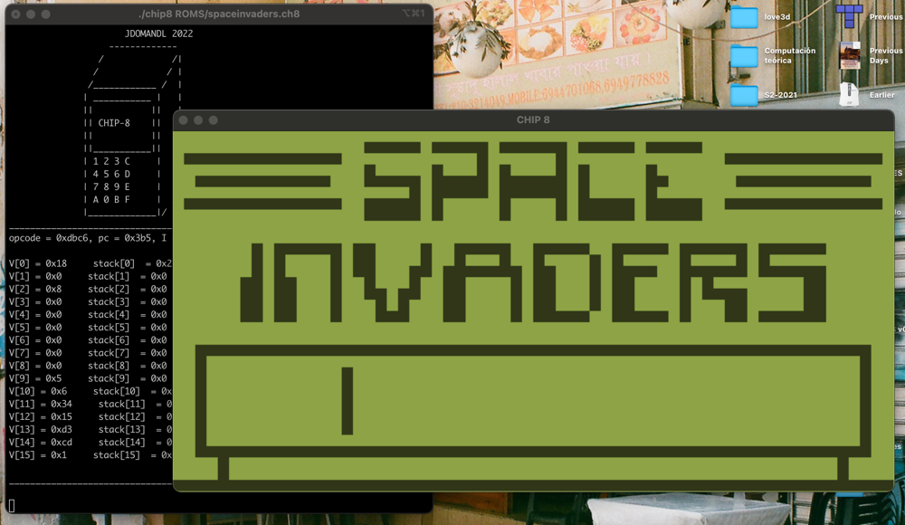

# CHIP8

Nothing new, just the hello world of emulation. I've made it to learn how emulation works and to practice more C (nice way to see the importance of bitwise ops). CHIP8 is a fantasy computer with an 8bits CPU, it's not real hardware.  

I encourage you to make one yourself, you will gain a lot of insights of how computer works. Implementing the opcodes was a lot of fun, the ISA wasn't so huge as  
the one of an x86 8080 8bits proccesor. Perhaps next time i make an NES or Z80 emulator.  

# Installation
For the graphics i've used `SDL2`, but first i tried just to make a terminal verison with `ncurses` but finally decided not to.  
Install dependencies with,  
`$ ./instal.sh`  

Compile with,  
`$ make`  

Run with,  
`$ ./chip8 ROMS/spaceinvaders.ch8`  

# Portability
Should work with MAC OS and Linux.

# Resources
Most of the code was guided by the tutorial and some of the code of [Laurence Muller](https://multigesture.net/articles/how-to-write-an-emulator-chip-8-interpreter/).  

[Wiki](https://en.wikipedia.org/wiki/CHIP-8#Virtual_machine_description)  

[Techinical reference](http://devernay.free.fr/hacks/chip8/C8TECH10.HTM)  
